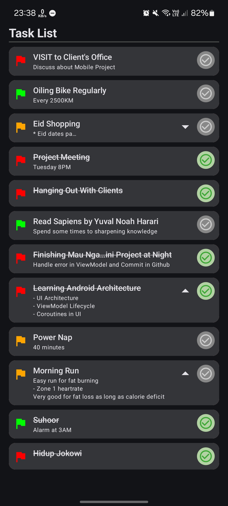
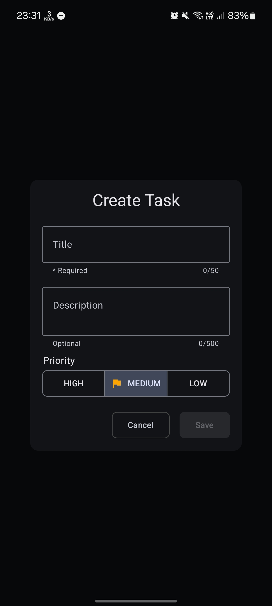
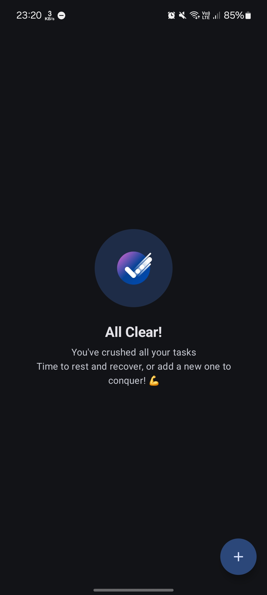

# 📝 Mau Ngapain - Modern Android To-Do App 🚀

**Mau Ngapain** is a fast, responsive, and local-first task management application built entirely with modern Android development standards. It is designed to demonstrate a **clean and structured** implementation of the MVVM architecture using the latest Android development tools.

This project focuses on **architectural clarity**, **separation of concerns**, and **predictable UI state management** rather than just feature complexity.

---

<p align="center">
  <b>Demo 💫</b>
</p>

<p align="center">
  
</p>

<div align="center">
  <table style="border-collapse: collapse; text-align: center;">
    <thead>
      <tr>
        <th colspan="3" style="padding: 10px;"><b>Screenshots 🖼️</b></th>
      </tr>
      <tr>
        <th style="padding: 10px; border-bottom: 1px solid #ddd;">Task List</th>
        <th style="padding: 10px; border-bottom: 1px solid #ddd;">Task Input Form</th>
        <th style="padding: 10px; border-bottom: 1px solid #ddd;">Empty State</th>
      </tr>
    </thead>
    <tbody>
      <tr>
        <td style="padding: 10px;">
          
        </td>
        <td style="padding: 10px;">
          
        </td>
        <td style="padding: 10px;">
          
        </td>
      </tr>
    </tbody>
  </table>
</div>

---

## ✨ Key Features

* **Complete CRUD Operations:** Create, Read, Update, and Delete tasks seamlessly.
* **Priority Levels:** Assign High, Medium, or Low priority to categorize tasks effectively.
* **Swipe to Delete:** Intuitive swipe gestures using the modern Compose `SwipeToDismissBox` paired with `LaunchedEffect` state observation.
* **Polished Empty State:** Engaging visual feedback when all tasks are cleared to reward the user.
* **Robust Error Handling:** Intercepts and handles database operation failures securely, providing fallback UI states without crashing.

## 🛠️ Tech Stack & Libraries

* **Language:** Kotlin
* **UI Framework:** Jetpack Compose (Material 3)
* **Architecture:** MVVM (Model-View-ViewModel)
* **Local Database:** Room Database (SQLite)
* **Dependency Injection:** Hilt (Dagger)
* **Asynchronous Programming:** Kotlin Coroutines & Flow

## 🏗️ Architecture & Core Principles

Mau Ngapain implements a strictly decoupled **2-Layer Architecture** (UI Layer and Data Layer) emphasizing the following design principles:
* **Single Responsibility Principle & Separation of Concerns:** Each class and layer has a single, well-defined purpose.
* **Dependency Inversion (SOLID):** The UI layer depends on abstractions (`TaskRepository` interface), not concrete implementations.
* **Data Integrity:** Form inputs are validated in real-time. Trimming and empty-string-to-null conversions are processed in the ViewModel before reaching the database, keeping the Entity layer pure.
* **Atomic Operations:** Fast local DB transactions are managed gracefully to prevent UI flickering and race conditions.

## 🔄 Unidirectional Data Flow (UDF) & State Management

The UI architecture follows a strict **State-Driven UI** pattern. The Jetpack Compose UI acts as a stateless, "dumb" component that purely reacts to state changes and sends events upward.

* **`TaskUiState` (State):** A single immutable data class representing the entire screen state (Loading, Data, Error, Form Inputs). This ensures the UI is predictable and prevents hidden mutable states.
* **`TaskUiEvent` (Event):** A sealed interface grouping all user interactions (e.g., `InputForm`, `FormNavigation`, `TaskAction`).
* **`TaskUiSideEffect` (Side Effect):** Handled via a Coroutine `Channel` (`receiveAsFlow`) to ensure one-time UI events like Snackbars are not re-triggered upon UI recomposition.

**ViewModel Responsibility:**
The `TaskViewModel` acts as the state holder, event processor, and business logic coordinator. It safely executes logic and exposes only an immutable UI state and a single event handler function to the UI.

## 📂 Project Structure & Layering

```text
├── data
│   ├── local
│   │   ├── dao        # Database access objects
│   │   ├── entity     # Room database schemas
│   │   └── enum       # Data type enumerations
│   └── repository     # Interfaces and implementations for data access
├── di                 # Hilt modules (DatabaseModule, RepositoryModule)
└── ui
    ├── screen         # Compose screens and ViewModels
    │   └── component  # Reusable modular UI components
    └── theme          # Material 3 typography, colors, and shapes
```

### Layer Responsibilities:
1. **Data Layer:** Configures the Room database and provides the `TaskRepositoryImpl`. This abstraction ensures the ViewModel never interacts directly with Room, allowing the data source to be swapped out without breaking the UI logic.
2. **DI Layer:** Uses Hilt modules to inject the `AppDatabase`, `TaskDao`, and bind the `TaskRepository`. This provides loose coupling and guarantees singleton instances to prevent memory leaks.
3. **UI Layer:** Built exclusively with Jetpack Compose.

## 🎨 UI Design Approach

The UI is built with **Jetpack Compose** using a highly modular approach:
* **Reusable Components:** Elements like `TaskItem`, `TaskInputForm`, `TaskList`, and `PriorityIcon` are isolated for reusability.
* **Explicit State Rendering:** The screen explicitly handles specific states (`EmptyState`, `ErrorState`, `DataState`) to avoid complex implicit branching logic inside the main screen composable.
* **Material 3 Theming:** Adheres to modern Android design guidelines.

## 🎓 What This Project Demonstrates

* Structured and scalable MVVM implementation.
* Clean separation between data sources and user interfaces.
* Advanced UI state management patterns using Kotlin Flow.
* Proper Dependency Injection setup from scratch.
* A "Compose-first" architecture mindset.

## 🚀 Possible Future Improvements

* Add a Domain Layer abstraction (Use Cases/Interactors) for complex business logic.
* Implement Unit Testing (ViewModel & Repository).
* Implement UI/Instrumentation Testing.
* Integrate a proper Navigation Architecture.
* Modularize the project (Multi-module setup).
* Cloud Syncing/Offline-first enhancements.

---
*Developed for learning and architectural demonstration purposes.*
